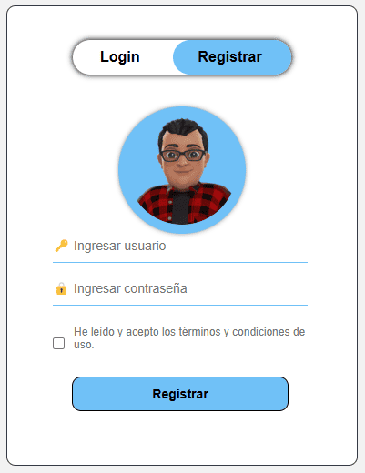

# Gestión de Acceso y Registro de Usuarios

Esta práctica se enfoca en el desarrollo de un sistema de gestión de acceso y registro de usuarios para una aplicación web. El código está escrito principalmente en PHP, HTML y CSS, con la integración de MySQL para la base de datos.

<p align="center">
  
</p>

La interfaz de usuario presenta dos secciones principales: el formulario de inicio de sesión y el formulario de registro. Los usuarios pueden alternar entre estas dos secciones haciendo clic en los botones correspondientes. Esta funcionalidad se logra mediante JavaScript.

<p align="center">
  
</p>

El formulario de inicio de sesión solicita al usuario su nombre de usuario y contraseña, con la opción de recordar la contraseña. Una vez que se ingresan las credenciales y se envían al servidor, PHP verifica la autenticidad de la información en la base de datos. Si las credenciales son correctas, el usuario es redirigido a una página de inicio de sesión exitosa. De lo contrario, se muestra un mensaje de error.

El formulario de registro permite a los usuarios crear nuevas cuentas proporcionando un nombre de usuario y una contraseña. Antes de agregar la cuenta a la base de datos, se verifica que el nombre de usuario no esté en uso. Si la cuenta se registra con éxito, se muestra un mensaje de confirmación.

Además, hay una página de inicio de sesión exitosa que muestra un mensaje de bienvenida al usuario autenticado y proporciona un botón para cerrar sesión. Cuando se hace clic en el botón, la sesión se destruye y el usuario es redirigido a la página de inicio.

En resumen, esta práctica demuestra la implementación de un sistema básico de gestión de acceso y registro de usuarios utilizando PHP, HTML, CSS y MySQL. Ofrece funcionalidades para iniciar sesión, registrar nuevas cuentas y cerrar sesión de manera segura.

**Consulta la versión preliminar de la practica aquí:** [https://practica_08.com](https://www.alejandrovillegas.dev/projects/practice-08/index.html)

# 📌 Información de la Practica

Esta practica ha sido desarrollado como parte del portafolio de soluciones tecnológicas, con el objetivo de ofrecer una herramienta eficiente y funcional para usuarios autodidactas interesados en la gestión y desarrollo de proyectos web.

- **Área**: Desarrollo de Practicas Web

- **Usuario Final**: TecNM

- **Fecha de Desarrollo**: 15 de agosto de 2018

- **Portafolio de Proyectos**: [www.alejandrovillegas.dev](https://www.alejandrovillegas.dev)

# Guía de Instalación y Configuración

## 🖥️ Requisitos del Sistema

Para ejecutar esta practica de manera local, es necesario contar con un entorno de desarrollo que incluya Apache, MySQL y PHP. Se recomienda el uso de **XAMPP**, ya que fue el entorno con el que se desarrolló la practica. Sin embargo, también es compatible con:

- **XAMPP** (Windows, macOS, Linux)

- **WAMP** (Windows)

- **MAMP** (macOS, Windows)

- **LAMP** (Linux)

## 🔧 Instalación y Configuración de la Practica

Siga los pasos según el entorno de desarrollo que esté utilizando:

### Para XAMPP (Recomendado)

1. Descargue y descomprima el archivo de la practica en su sistema local.

2. Copie la carpeta de la practica y colóquela en el directorio **_htdocs_** dentro de la carpeta de instalación de XAMPP (Ejemplo: **C:\xampp\htdocs\mi_practica**).

### Para WAMP

1. Descargue y descomprima el archivo de la practica.

2. Copie la carpeta de la practica y colóquela en el directorio **_www_** dentro de la carpeta de instalación de WAMP (Ejemplo: **C:\wamp64\www\mi_practica**).

### Para MAMP

1. Descargue y descomprima el archivo de la practica.

2. Copie la carpeta de la practica y colóquela en el directorio **_htdocs_** dentro de la carpeta de instalación de MAMP (Ejemplo: **/Applications/MAMP/htdocs/mi_practica**).

### Para LAMP

1. Descargue y descomprima el archivo de la practica.

2. Mueva la carpeta de la practica a **_/var/www/html/_** utilizando el siguiente comando en la terminal:

```
sudo mv mi_practica /var/www/html/
```

## 🗄️ Configuración de la Base de Datos

### Para XAMPP, WAMP y MAMP

1. Inicie su entorno de desarrollo y asegúrese de que **Apache** y **MySQL** estén en ejecución.

2. Abra su navegador y acceda a **_phpMyAdmin_** ingresando:

- **XAMPP**: http://localhost/phpmyadmin

- **WAMP**: http://localhost/phpmyadmin

- **MAMP**: http://localhost:8888/phpmyadmin

3. Diríjase a la pestaña **SQL** e ingrese el siguiente código para crear la base de datos:

```
CREATE DATABASE General;
```

4. Vaya a la pestaña Importar y seleccione el archivo **_DataBase.sql_** del repositorio para importar la estructura y los datos.

### Para LAMP

1. Abra la terminal y acceda a MySQL con:

```
mysql -u root -p
```

2. Cree la base de datos ejecutando:

```
CREATE DATABASE General;
```

3. Salga de MySQL y luego importe la base de datos con:

```
mysql -u root -p General < /ruta/del/archivo/DataBase.sql
```

Reemplace **_/ruta/del/archivo/_** con la ubicación real del archivo en su sistema.

## 🚀 Ejecución de la Practica

1. Inicie su entorno de desarrollo:

- **XAMPP**: Abra el "Panel de Control de XAMPP" y active **Apache** y **MySQL**.

- **WAMP**: Haga clic en el icono de WAMP y active los servicios.

- **MAMP**: Abra MAMP y haga clic en **Start Servers**.

- **LAMP**: Ejecute los siguientes comandos en la terminal:

```
sudo systemctl start apache2
sudo systemctl start mysql
```

2. Abra un navegador e ingrese la siguiente URL según el entorno:

- **XAMPP / WAMP**: **_http://localhost/_**

- **MAMP**: **_http://localhost:8888/_**

- **LAMP**: **_http://localhost/_**

La practica ahora está funcionando en su entorno local. 🎉

## 🔑 Credenciales de Acceso

### 👤 Detalles de Inicio de Sesión para Usuario Preregistrado

- Nombre de usuario: **_Usuario01@invendo.com_**

- Contraseña: **_12345_**

Tambien puede **registrar un nuevo usuario** desde la interfaz de la aplicación.
